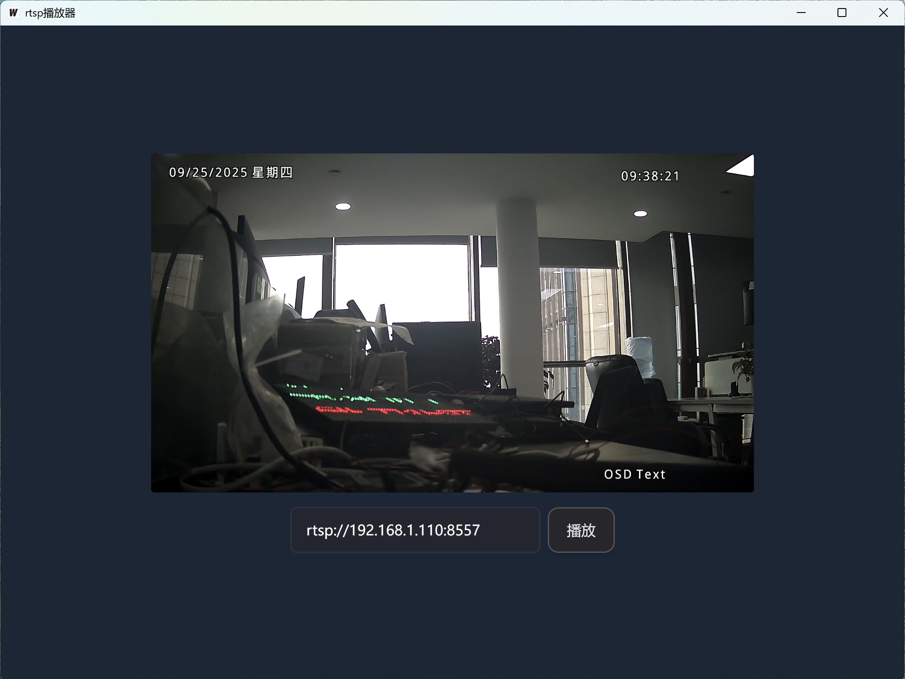
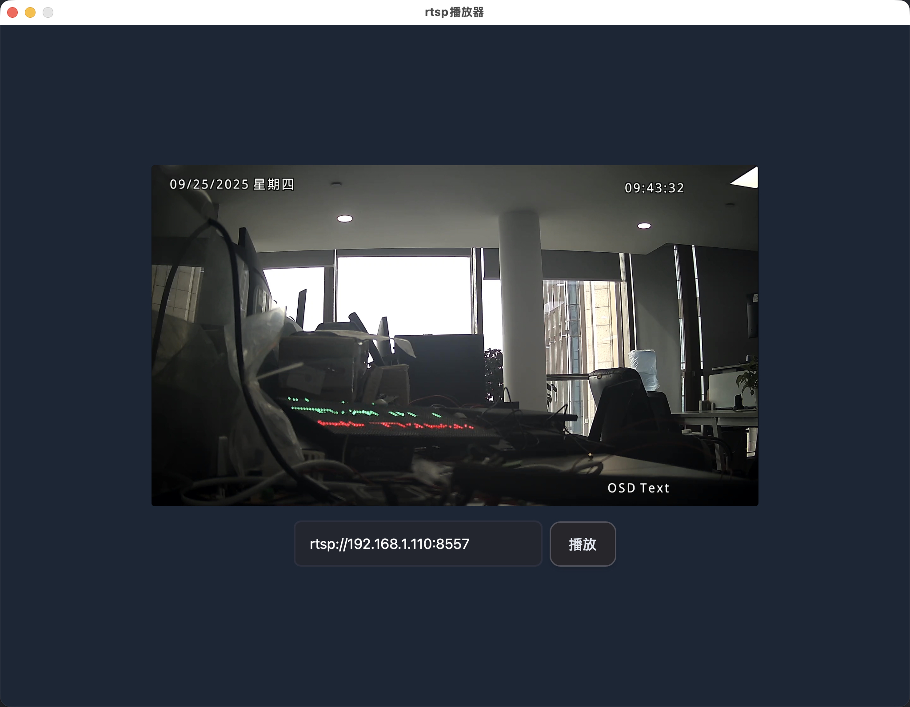

# RTSP 播放器

一个基于 Wails 框架开发的跨平台 RTSP 视频流播放器，支持 WebRTC 技术实现低延迟视频播放。

## 📋 项目概述

本项目是一个现代化的 RTSP 视频流播放器，采用 Go 后端处理视频流，React + TypeScript 前端构建用户界面。通过 WebRTC 技术实现 RTSP 流到 Web 端的高效转换和播放，具有低延迟、高画质的特点。

## ✨ 核心功能

- 🎥 **RTSP 流播放**: 支持标准 RTSP 协议视频流播放
- 🚀 **WebRTC 转换**: 将 RTSP 流转换为 WebRTC 格式，实现低延迟播放
- 🖥️ **跨平台支持**: 基于 Wails 框架，支持 Windows、macOS、Linux
- 📱 **现代化界面**: React + TypeScript + TailwindCSS 构建的响应式界面
- ⚡ **高性能**: Go 语言后端，高效的视频流处理

## 🏗️ 技术架构

### 后端技术栈

- **Go 1.23+**: 主要开发语言
- **Wails v2**: 跨平台桌面应用框架
- **deepch/vdk**: 视频处理库，支持 RTSP 和 WebRTC
- **Logrus**: 结构化日志记录

### 前端技术栈

- **React 18**: 用户界面库
- **TypeScript**: 类型安全的 JavaScript
- **Vite**: 快速构建工具
- **TailwindCSS**: 原子化 CSS 框架

## 📸 平台预览

|              Windows 平台              |              macOS 平台              |
| :------------------------------------: | :----------------------------------: |
|  |  |

## 🚀 快速开始

### 环境要求

- Go 1.23 或更高版本
- Node.js 16+ 和 npm
- Wails CLI 工具

### 安装依赖

1. **安装 Wails CLI**

   ```bash
   go install github.com/wailsapp/wails/v2/cmd/wails@latest
   ```

2. **克隆项目**

   ```bash
   git clone git@github.com:knight-L/rtspPlayer.git
   cd rtspPlayer
   ```

3. **安装前端依赖**

   ```bash
   cd frontend
   npm install
   cd ..
   ```

### 开发模式

启动开发服务器（支持热重载）：

```bash
wails dev
```

开发模式特性：

- 前端热重载
- 后端自动重编译
- DevTools 支持
- 浏览器调试模式（访问 http://localhost:34115）

### 生产构建

构建可发布的应用程序：

```bash
wails build
```

构建产物将生成在 `build/bin/` 目录下。

## 📖 使用说明

### 基本使用

1. **启动应用**: 运行构建后的可执行文件
2. **输入 RTSP 地址**: 在输入框中输入有效的 RTSP 流地址
   ```
   示例: rtsp://192.168.1.110:8557
   ```
3. **开始播放**: 点击"播放"按钮开始视频流播放

### 支持的 RTSP 格式

- RTSP over TCP/UDP
- H.264 视频编码
- 标准 RTSP 认证

## 🔧 配置说明

### 项目配置文件

**wails.json** - Wails 项目配置

```json
{
  "name": "rtspPlayer",
  "outputfilename": "rtspPlayer",
  "frontend:install": "npm install",
  "frontend:build": "npm run build",
  "frontend:dev:watcher": "npm run dev",
  "author": {
    "name": "",
    "email": ""
  }
}
```

### WebRTC 配置

项目支持自定义 WebRTC 配置，包括：

- ICE 服务器设置
- 端口范围配置
- 连接认证

## 📁 项目结构

```
.
├── frontend/                # 前端代码
│   ├── src/
│   │   ├── App.tsx
│   │   ├── WebRtcPlayer.tsx
│   │   ├── Loading.tsx
│   │   └── main.tsx
│   ├── package.json
│   └── vite.config.ts
├── main.go                  # 应用入口
├── app.go
├── streamCore.go
├── streamWebRTC.go
├── storageStruct.go
├── storageServer.go
├── storageClient.go
├── storageStreamChannel.go
├── supportFunc.go
├── loggingLog.go
└── wails.json
```

## 🐛 故障排除

### 常见问题

1. **无法连接 RTSP 流**

   - 检查 RTSP 地址是否正确
   - 确认网络连接是否正常
   - 验证 RTSP 服务是否在线

2. **视频无法播放**

   - 检查浏览器 WebRTC 支持
   - 确认视频编码格式兼容性
   - 查看控制台错误信息

3. **连接频繁断开**

   - 检查网络稳定性
   - 调整 WebRTC 端口范围
   - 查看后端日志信息

### 日志调试

开启调试模式查看详细日志：

```bash
wails dev -debug
```

## 📝 许可证

本项目采用 MIT 许可证 - 查看 [LICENSE](LICENSE) 文件了解详情。

## 🙏 致谢

- [Wails](https://wails.io/) - 跨平台桌面应用框架
- [deepch/vdk](https://github.com/deepch/vdk) - 视频处理库
- [React](https://reactjs.org/) - 用户界面库
- [TailwindCSS](https://tailwindcss.com/) - CSS 框架
